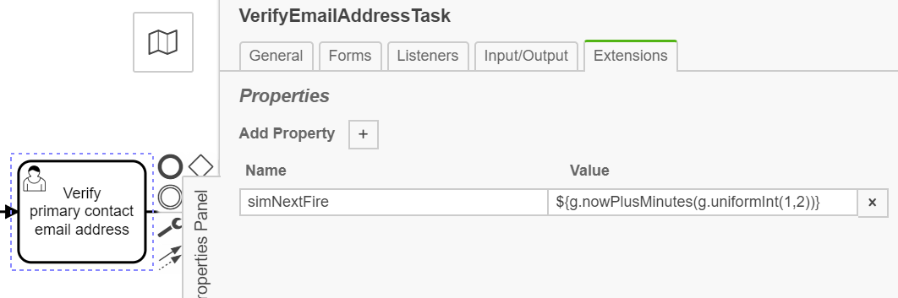
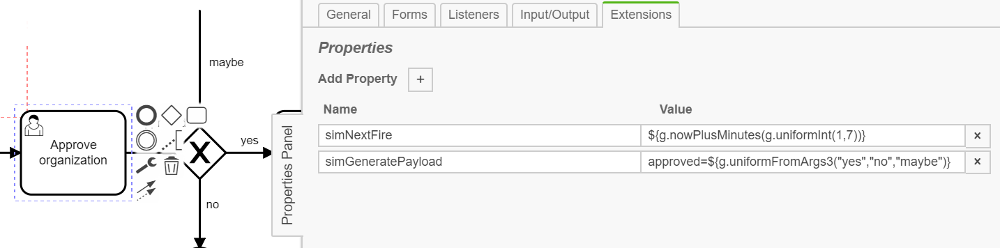

# camunda-bpm-simulator

Camunda process engine plugin to simulate process execution.

## Purpose

When execution process definitions, the process engine waits from time to time for external events, for example user actions, conditions, timeouts etc.
This process engine plugin will generate these events to run processes without external interaction, hence, to simulate real world scenarios.

They way if and when these events are triggered and if and what payload data is to be generated is configured by [Camunda Properties](https://docs.camunda.org/manual/7.9/reference/bpmn20/custom-extensions/extension-elements/#properties) in the bpmn-files.
Optionally, all these properties can be set externally, for example in property files.

The plugin is able to simulate the past...

## How-To

Have a look at the example project, it is intended to be self explanatory.

## Properties for controlling

### None/Message/Signal/Conditional start event

* `simNextFire` : `<expression giving date>`
* `simInitBusinessKey` : `<expression giving string>`
* `simInitPayload` : `<varname>=<expression giving arbitrary value>`

### Message Receive events, Receive Task, Signal receive events

* `simNextFire` : `<expression giving date>`

Note for signals: The signal is not delivered globally but only to the execution that waits at the receive event.

### User Task

* `simNextFire` : `<expression giving date>`

TODO: Also simulate assignee, candidates, claiming...

### Service Task (Send Task, Business Rule Task, Script Task)

Replace behaviour by no-op, except following is set:

* `simCallRealImplementation` : `true`

### External Service Task

* `simNextFire` : `<expression giving date>`

### Business Rule Task

Replace behaviour by no-op, except DMN, this is "normally" called.

### All Flow Elements

#### Execution (Task) Listeners

Always stripped away, except the following is set:

* `simKeepListeners` : `true`

#### Properties for payload generation

* `simGeneratePayload` : `<varname>=<expression giving arbitrary value>`

## Integration into your project

You have to

1. load the simulator engine plugin
1. (if needed) add your own payload generator

In the example project, this is done in spring-boot by simply registering two beans.
One holds the plugin itself (and the Camunda spring-boot-starter does some magic to load it on engine bootstrap).
The second is the payload generator shipped with the plugin.
Here, you can give your own payload generator bean, for example by inheriting from the shipped one and adding domain based functionality (if it is not domain specific -- please contribute your work to this plugin).

For other containers of the Camunda engine like tomcat, wildfly etc., especially those without DI, you can set your custom payload generator as follows:

```java
public class MyProject {
  static {
    SimulatorPlugin.setPayloadGenerator(new MyShinyPayloadGenerator());
  }
}
```

It is in a static block since you have to make sure it is executed as soon as possible, in particular before any BPMN file is parsed by the engine.

The so provided payload generator can be accessed in expressions with the name ```g```.
By default, the shipped payload generator is used, so it is always possible to use expressions in properties like ```simGeneratePayload: name=${g.firstname()}```, even if you are in a non-DI setup.


## Quick start with Spring Boot

- Add the simulator dependency to your pom file. There is an entry in Maven Central for the BPM simulator. Be sure to check for newer versions.

  ```xml
  <dependency>
    <groupId>com.camunda.consulting</groupId>
    <artifactId>camunda-bpm-simulator</artifactId>
    <version>1.1.2</version>
  </dependency>
  ```

- Add the follow line of code to your Camunda Application class. You can experiment with time frames: **SimulationExecutor.execute(DateTime.now().minusMonths(1).toDate(), DateTime.now().toDate());**

  ```java
  public static void main(String... args) {
    SpringApplication.run(CamundaApplication.class, args);
    SimulationExecutor.execute(DateTime.now().minusMonths(1).toDate(), DateTime.now().toDate());
  }
  ```

- Add the following bean to your Camunda Application class:

  ```java
  @Bean
  public SimulatorPlugin simulatorPlugin() {
        return new SimulatorPlugin();
    }
  ```

- Be sure the following imports have been added to the Camunda Application class:

  ```javascript
  import com.camunda.consulting.simulator.SimulationExecutor;
  import com.camunda.consulting.simulator.SimulatorPlugin;
  ```

- Next, add extensions to various nodes in your process. You'll need extensions on start nodes, human tasks, and some service tasks. In the **Extensions** tab add a property called **simNextFire** with a value of  **${g.timesPerDay("a_unique_name","start_time_in_24_hour_format","end_time_in_24_hour_format", number_of_times_you_want_to_fire_in_that_duration)}**. See below. The 'g' object is understood by the plugin to be the simulator generator object.

  

  

- Add **simNextFire** extensions to human tasks. Service tasks, business rules tasks, send tasks, and script tasks run as no ops during simulation. A sample value for a human could be **${g.nowPlusMinutes(g.uniformInt(minimum_minute_duration, maximum_minute duration))}**. This will produce a uniform distribution of duration values from the minimum to the maximum. You can also use milliseconds, seconds, hours, days, weeks, months, or years.

  

- You can add a wide range of data to the process using **simGeneratePayload** property. In this example we'd like the simulator to select between three values - "yes", "no", or "maybe". It then assigns the value to the "approved" variable which is needed for the gateway to work.

  

- Now when you start the application the simulator will generate process instance and task instance data to make Cockpit and Optimize reports more interesting to view without having to run process instances manually. Be sure to have a look at the **PayloadGenerator** and **SimulationExecutor** classes for additional methods to use. 


## TODO

* think about throwing BPMN errors
* think about keeping execution/task listeners/
